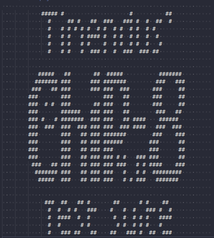
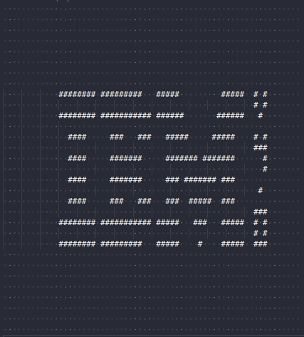
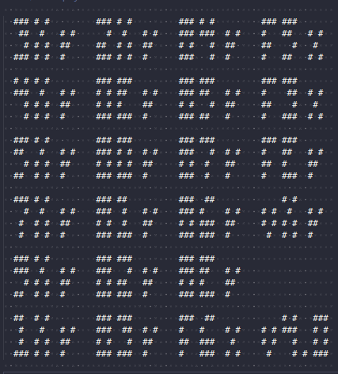
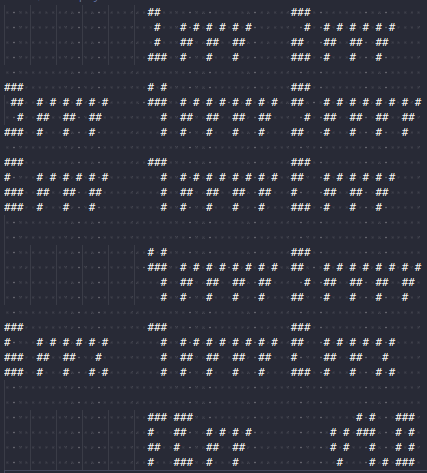

# Chip8 Emulator

A simple emulator with output to a file that implements Chip8 instructions.

This emulator doesn't support the keyboard and features that allow you control the version of Chip8 (Chip8, SUPER Chip8 etc)

I tested it on this test suite <https://github.com/Timendus/chip8-test-suite> and successfully passed the first 3 tests. In the 4th test, all instruction passed, except for the shift instructions, which is ambiguous and expect a "quirks" support. You can find more information here <https://tobiasvl.github.io/blog/write-a-chip-8-emulator/#8xy6-and-8xye-shift>







## Build

```shell
mkdir build
cd build
cmake ..
make -j
```

## Usage

```shell
Usage: chip8emulator [--help] [--version] ROM path

Chip8 emulator

Positional arguments:
  ROM path      Path to Chip8 ROM file 

Optional arguments:
  -h, --help    shows help message and exits 
  -v, --version prints version information and exits
```
